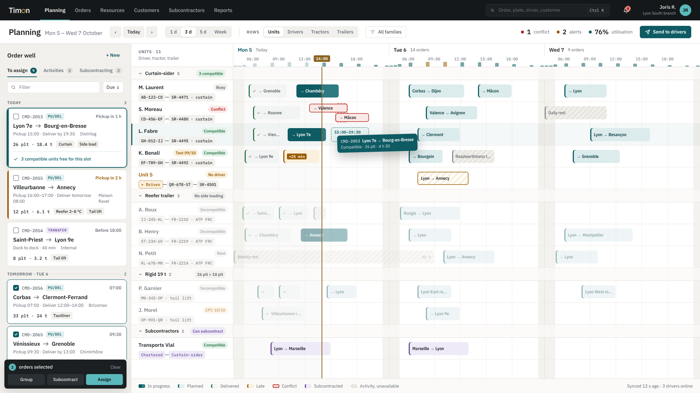

# Timon

[](https://github.com/jojoricard/timon-tms/actions/workflows/ci.yml)
[](https://github.com/jojoricard/timon-tms/actions/workflows/docs.yml)

**An open-source transport management system for road hauliers, built around resource planning.**

Timon helps a dispatcher plan drivers, tractors, rigid trucks and trailers, assign orders in one gesture and see conflicts before they happen: a resource booked twice, an expired licence, the wrong trailer for the load.

> In French, a _timon_ is the drawbar that ties a team to its wagon, and a _timonier_ holds the helm. Timon holds resources together and helps the dispatcher keep the day on course.



## Status

**Planning release in progress.** Scoping, visual identity, architecture and environments are decided and recorded in [`docs/`](docs/). The first feature is in: resources ([SPEC-001](docs/specs/0001-resources.md)). Drivers, power units and trailers with their capabilities and compliance documents, the status of each document on today's date, the expiries to renew, and a CSV import. It runs on Node with PostgreSQL and entirely in the browser.

| Phase               | Content                                                                                  | Status      |
| ------------------- | ---------------------------------------------------------------------------------------- | ----------- |
| 0. Scoping          | Vision, target, market, regulation, domain model, roadmap                                | Done        |
| 1. Foundations      | Visual identity and design system, architecture and environments, code skeleton and CI   | Done        |
| 2. Planning release | Reference data (resources done), units, orders, planning and conflicts, emissions report | In progress |
| 3–5                 | Extended operations, driver app, customer portal                                         | Later       |

**Demo:** [timon.agence-jri.com](https://timon.agence-jri.com). It runs entirely in your browser: the API and a PostgreSQL database (PGlite) live in a service worker, and your data stays on your machine.

## Documentation

| Document                                                                                     | Source                                                                        | PDF                                                                                                                |
| -------------------------------------------------------------------------------------------- | ----------------------------------------------------------------------------- | ------------------------------------------------------------------------------------------------------------------ |
| Project scoping: vision, target, market, regulation, domain model, scope, roadmap, decisions | [scoping.md](docs/scoping.md)                                                 | [PDF](https://github.com/jojoricard/timon-tms/releases/latest/download/TIMON-CAD-001-scoping.pdf)                  |
| ADR-001: TypeScript and PostgreSQL                                                           | [0001-typescript-postgresql.md](docs/adr/0001-typescript-postgresql.md)       | [PDF](https://github.com/jojoricard/timon-tms/releases/latest/download/TIMON-ADR-001-language-and-database.pdf)    |
| ADR-002: target architecture, one codebase for the server and an in-browser demo             | [0002-target-architecture.md](docs/adr/0002-target-architecture.md)           | [PDF](https://github.com/jojoricard/timon-tms/releases/latest/download/TIMON-ADR-002-target-architecture.pdf)      |
| ADR-003: environments and hosting, from the laptop to the public demo                        | [0003-environments-and-hosting.md](docs/adr/0003-environments-and-hosting.md) | [PDF](https://github.com/jojoricard/timon-tms/releases/latest/download/TIMON-ADR-003-environments-and-hosting.pdf) |
| SPEC-001: resources, their capabilities and expiring documents                               | [0001-resources.md](docs/specs/0001-resources.md)                             | [PDF](https://github.com/jojoricard/timon-tms/releases/latest/download/TIMON-SPEC-001-resources.pdf)               |
| SPEC-002: customers, sites and their requirements                                            | [0002-customers-and-sites.md](docs/specs/0002-customers-and-sites.md)         | [PDF](https://github.com/jojoricard/timon-tms/releases/latest/download/TIMON-SPEC-002-customers-and-sites.pdf)     |
| Brand guidelines: logo, colour, type, signature elements, screens, voice                     | [guidelines/](docs/design/guidelines/index.html)                              | [PDF](docs/design/timon-brand-guidelines.pdf)                                                                      |

The Markdown files are the sources. A GitHub Actions workflow builds the Word and PDF versions on every change and attaches them to each release; locally, `sh docs/export/build-docs.sh` produces the Word files (requires [pandoc](https://pandoc.org/)).

## Run it locally

You need Node 24, pnpm 10 and Docker. The pnpm version is pinned in `package.json`; pnpm switches to it on its own.

```sh
pnpm install
cp .env.example .env        # local settings; change POSTGRES_PORT and DATABASE_URL if 5432 is taken
docker compose up -d        # PostgreSQL 18
pnpm db:migrate
pnpm db:seed                # the demo haulier near Lyon
pnpm dev                    # API on :3000, interface on http://localhost:5173
```

Without Docker, `pnpm dev:demo` builds and serves the in-browser demo on http://localhost:4173.

| Command                              | What it does                                                                                             |
| ------------------------------------ | -------------------------------------------------------------------------------------------------------- |
| `pnpm test`                          | Unit and API tests, on PGlite in-process; set `TEST_DATABASE_URL` to run them on PostgreSQL              |
| `pnpm test:e2e`                      | Playwright journeys on the demo build, one per acceptance criterion shown on screen (`pnpm build` first) |
| `pnpm lint`, `pnpm format`           | Biome                                                                                                    |
| `pnpm typecheck`                     | TypeScript, every package                                                                                |
| `pnpm check:deps`, `pnpm check:i18n` | Dependency direction of ADR-002; French and English messages complete                                    |
| `pnpm db:generate`                   | New migration from the Drizzle schema                                                                    |

| Path              | Role                                                                               |
| ----------------- | ---------------------------------------------------------------------------------- |
| `packages/domain` | Rules: periods and overlaps, plates, kinds and categories, document status. No I/O |
| `packages/app`    | Use cases and the ports they need                                                  |
| `packages/db`     | Drizzle schema, migrations, repositories, demo data                                |
| `packages/http`   | Hono routes, Zod schemas, OpenAPI contract at `/api/openapi.json`                  |
| `packages/ui`     | React components on the design tokens                                              |
| `apps/web`        | The interface (React, Vite, TanStack Router and Query, Paraglide)                  |
| `apps/api`        | Node entry: Hono on node-postgres                                                  |
| `apps/demo`       | The interface plus a service worker running the API on PGlite                      |

## Tech stack

TypeScript across the interface, the API and a shared `domain` package; PostgreSQL. React and Vite for the interface, Hono for a REST API with an OpenAPI contract, Drizzle for data access, in a pnpm monorepo. The same API runs on Node in production and in the browser, on PGlite, for the public demo. See [ADR-001](docs/adr/0001-typescript-postgresql.md) and [ADR-002](docs/adr/0002-target-architecture.md).

## How the project is run

One scoping phase, then a Kanban flow: each feature gets a short spec, a mockup, an ADR when needed, tests derived from its acceptance criteria and a demo. Work is tracked on the project's public GitHub Projects board.

## License

[GNU AGPL-3.0](LICENSE). You can use, modify and self-host Timon; if you offer it as a service, you must publish your changes.

---

Designed and built by Joris Ricard · Agence JRi
