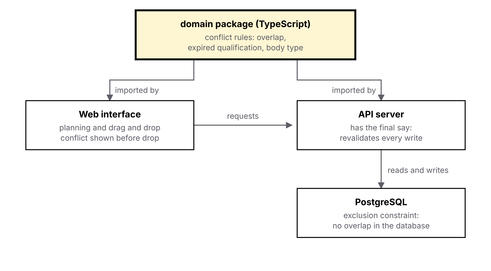

# TIMON-ADR-001 — Language and database

## Context

Planning is the core of Timon. The dispatcher drags an order onto a unit and must see right away if something is wrong: resource already booked, expired qualification, wrong body type. So these rules must run in the browser during drag and drop, and on the server too, which has the final say. I develop alone, and the project must stay easy to self-host.

## Options considered

| Criterion | TypeScript | C# / .NET | Python | Go |
| --- | --- | --- | --- | --- |
| Rules shared by front and back end | Yes, same package | Only with a Blazor (WebAssembly) interface | Only through Pyodide (WebAssembly, heavy) | Only through WebAssembly |
| Rich domain model | Good (discriminated unions) | Very good | Fair | Weak (no sum types) |
| Future route optimisation | Separate service | Native OR-Tools | Native OR-Tools | Limited |
| Self-hosting | Docker | Docker | Docker | Single binary |

PostgreSQL is chosen whatever the language: an exclusion constraint `EXCLUDE USING gist (resource_id WITH =, period WITH &&)` (extension `btree_gist`) rejects, at database level, two units overlapping for the same resource.

## Decision

> **Decision:** TypeScript across the whole project (interface, API and a shared `domain` package), PostgreSQL for the database.
>
> **Why:** it is the only option where the conflict rules are written once and run natively on both sides, with the interface ecosystem I want (React); the others need a WebAssembly front end to share them. PostgreSQL adds a safety net: the exclusion constraint blocks an overlap even if the code lets it through.

## Consequences

- **What it makes simpler:** one language, types shared between API and interface, the same tests for the rules.
- **What it costs:** no serious equivalent to OR-Tools in TypeScript. If route optimisation comes, it will be a separate service, in the best-suited language.
- **What to watch:** the `domain` package must depend on neither the browser nor Node, or the sharing breaks.

## Diagram

{width=100%}
