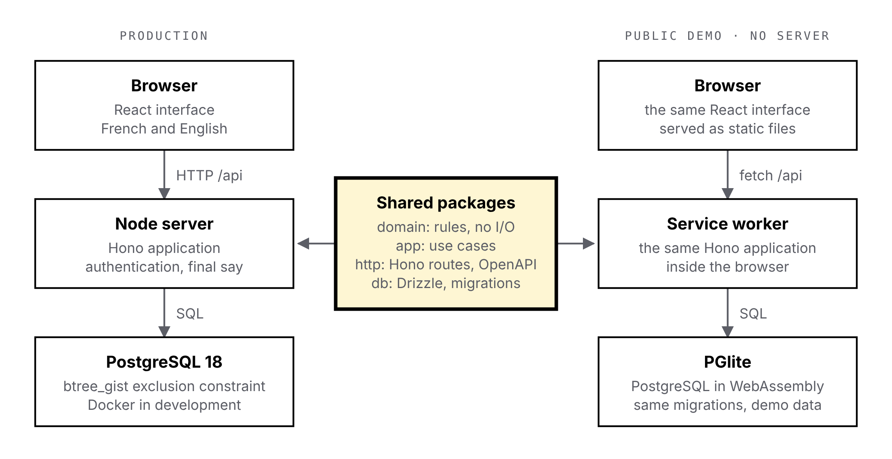

# TIMON-ADR-002 — Target architecture

## Context

[ADR-001](0001-typescript-postgresql.md) settled the language and the database. This one settles how the code is split and what runs where. Three constraints shape it:

- The conflict rules must run in the browser during drag and drop and on the server for every write, from the same code.
- The public demo must cost nothing and never go to sleep. A free server that wakes up on the first visit gives a poor first impression; a demo that runs entirely in the visitor's browser has neither problem.
- I develop alone. Every layer I add must earn its place, and the whole project must start with one command.

The interface is React and the API is REST with an OpenAPI contract: React for its ecosystem around dense, interactive screens (drag and drop, virtualised lists), REST because hauliers, customers and subcontractors will one day call the API themselves.

## Options considered

The demo constraint decides most of it: the API and the database must also run in a browser.

| API framework | Runs in the browser | Contract from the code | Weight |
| --- | --- | --- | --- |
| **Hono** | Yes, built on web standards, official service worker adapter | Yes, Zod schemas to OpenAPI | Light |
| Fastify | No, Node only | Yes, JSON Schema | Light |
| NestJS | No, Node only | Yes, decorators | Heavy for one developer |
| Express | No, Node only | No, written by hand | Light, dated |

| Data access | PGlite support | Exclusion constraint, `tstzrange` | Style |
| --- | --- | --- | --- |
| **Drizzle** | Official driver | Hand-written SQL migrations alongside generated ones | SQL-like, typed |
| Prisma | Community adapter only | Not in the schema language, raw SQL in migrations | Declarative schema, generated client |
| Kysely | Built-in dialect | Raw SQL in hand-written migrations, no schema tool | Query builder only |

[PGlite](https://pglite.dev/extensions/) runs PostgreSQL in WebAssembly and ships the `btree_gist` extension, so the exclusion constraint of ADR-001 works in the demo as it does in production.

## Decision

> **Decision:** a pnpm monorepo where the rules, the use cases, the HTTP routes and the database access are runtime-agnostic packages. In production they run on Node with PostgreSQL; in the public demo the same Hono application runs in a service worker on top of PGlite, and the interface does not know the difference.
>
> **Why:** one codebase, two places to run it, and a demo that costs nothing. The database keeps its safety net in both, because PGlite is real PostgreSQL.

| Package | Role | May depend on |
| --- | --- | --- |
| `packages/domain` | Rules: overlaps, compatibility, order shape. No I/O | nothing |
| `packages/app` | Use cases and the ports they need | `domain` |
| `packages/db` | Drizzle schema, migrations, repositories | `app`, `domain` |
| `packages/http` | Hono routes, Zod schemas, OpenAPI | `app`, `domain` |
| `packages/ui` | React components on the design tokens | nothing |
| `apps/web` | React app (Vite, TanStack, dnd-kit); checks a drop with `domain` | `ui`, `domain`; types only from `http`, for the typed API client |
| `apps/api` | Node entry: Hono, `node-postgres`, authentication | `http`, `db` |
| `apps/demo` | Service worker: the same Hono app, PGlite, demo data | `http`, `db`, `web` to mount the interface |

Supporting choices:

- **TypeScript 7**, the native compiler, for faster type checks. It no longer exposes a JavaScript compiler API, so tools built on it, such as dependency-cruiser, do not work; the dependency direction above is checked by a short script that reads the manifests and the imports.
- **Packages shipped as TypeScript sources:** no build step for the shared packages. Vite bundles them for the browser and the service worker; Node 24 runs the API directly, with its built-in type stripping. The code therefore uses only erasable syntax (no enums, no parameter properties) and imports files with their `.ts` extension.
- **PostgreSQL 18**, the version the current PGlite release (0.5) is built on, so the demo and production never diverge on SQL. Both are upgraded together.
- **Dates:** periods stored as `tstzrange`, handled with the Temporal API. Chrome, Firefox and Node 26 ship it; a polyfill covers Safari and Node 24 in the meantime.
- **Interface languages:** Paraglide JS, messages compiled to typed functions. Paraglide falls back to English when a French message is missing, so a CI check compares the two message files and fails on any gap.
- **Styling:** CSS variables generated from `docs/design/tokens.json`; no CSS framework, the design system already defines the scale.
- **Tests:** Vitest for `domain` and `app`; API tests against PGlite in-process, without Docker; the same suite against a real PostgreSQL container in CI; Playwright on the demo build for the key journeys.

## Consequences

- **What it makes simpler:** a public demo at zero cost that never sleeps; fast tests without Docker; one contract for our interface and for third parties; the dependency direction in the table above is checked in CI.
- **What it costs:** every package except `apps/api` must avoid Node-only APIs; Drizzle has no built-in range type, so `tstzrange` is declared as a custom column type and the exclusion constraint lives in a hand-written migration; the demo has no real authentication and stores data in the visitor's browser only; PGlite adds about 5 MB, compressed, to the first load of the demo.
- **What to watch:** behaviour gaps between PGlite and PostgreSQL (the CI runs both); the service worker lifecycle (updates, first visit before it is active); the Temporal polyfill, to remove once support is native.
- **Out of scope here:** authentication, hosting of the production server, maps and truck routing. Each gets its own ADR when a feature needs it.

<!-- pagebreak -->

## Diagram

{width=86%}
