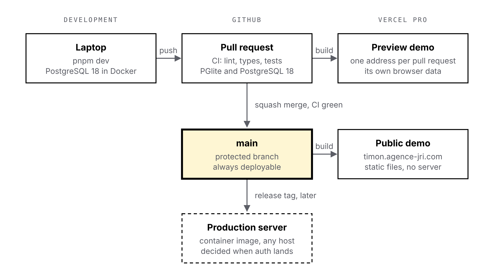

# TIMON-ADR-003 — Environments and hosting

## Context

[ADR-002](0002-target-architecture.md) made the public demo a set of static files: the API and the database run in the visitor's browser. This record settles where the code runs at each stage, from my laptop to the public address, and how a change travels between them. Three constraints apply:

- Everything must run locally, offline and at no cost. A paid service is acceptable only where it adds something the laptop cannot: a public address, a preview of each change.
- I already pay for a Vercel Pro account for other projects. Using it costs nothing extra as long as Timon stays within the included usage.
- Timon is licensed under AGPL-3.0, so anyone must be able to run it on their own machine without depending on a vendor.

## Options considered

The demo needs static hosting that serves a service worker and WebAssembly with the right headers, and ideally a separate address for each pull request.

| Demo host | Preview per pull request | Custom headers | Cost for Timon |
| --- | --- | --- | --- |
| **Vercel** | Yes, automatic | Yes, `vercel.json` | None: within the $20 monthly credit of the Pro plan |
| Cloudflare Pages | Yes, unlimited | Yes, `_headers` file | Free, 500 builds a month |
| Netlify | Yes, unlimited | Yes, `_headers` file | Free: 300 credits a month, about 15 GB of traffic; site paused when spent |
| GitHub Pages | No | No | Free, but not meant for commercial use |

All four would serve the demo. Vercel wins because the account, the billing alerts and the GitHub integration already exist, and because the Pro plan allows commercial use, which the [Hobby plan does not](https://vercel.com/pricing).

The production server is a different question: it needs a running process and a PostgreSQL database.

| Production server | Always on | PostgreSQL 18 with `btree_gist` | Cost |
| --- | --- | --- | --- |
| Vercel Functions with Neon | Functions start on demand | Yes, managed by Neon | Free tier: 1 GB, compute paused after 5 minutes idle |
| Render with Neon | No, the free service sleeps after 15 minutes | Yes, managed by Neon | Free, about a minute to wake up |
| Oracle Cloud Always Free VM | Yes | Yes, self-managed in Docker | Free, capacity often unavailable, everything to maintain |
| Any VM or container platform | Yes | Yes, in Docker | A few euros a month |

None of these is needed before Timon has authentication and real users. [Neon's free plan](https://neon.com/pricing) is enough to try a hosted version, but the choice depends on the authentication ADR, so it waits.

## Decision

> **Decision:** local development with Docker for PostgreSQL only; the public demo and a preview per pull request on the Vercel Pro account; GitHub flow with a protected `main`. The production server is packaged as a container image from the start and its host is chosen when authentication lands.
>
> **Why:** the laptop covers everything that costs money elsewhere, Vercel adds the two things it cannot provide at no extra cost, and the container image keeps self-hosting the reference rather than an afterthought.

| Environment | Runs on | Database | Address |
| --- | --- | --- | --- |
| Development | Laptop, `pnpm dev` | PostgreSQL 18 in Docker | `localhost` |
| Tests | Laptop and CI | PGlite; PostgreSQL 18 in CI | none |
| Preview demo | Vercel, per pull request | PGlite, in the browser | generated |
| Public demo | Vercel, from `main` | PGlite, in the browser | `timon.agence-jri.com` |
| Production | Container, host to be decided | PostgreSQL 18 | to be decided |

On the laptop:

- **Runtime:** Node 24, the current LTS and Vercel's default, pinned in `.nvmrc` and in `engines`. The pnpm version is pinned in `packageManager`, which pnpm itself enforces; Corepack is not relied on, since Node stopped shipping it in version 25. Node 26 becomes LTS on [October 28, 2026](https://github.com/nodejs/release#release-schedule); the project moves to it once Vercel offers it.
- **Local database:** a `compose.yaml` with the official `postgres:18` image, which includes `btree_gist`. Docker Desktop on Windows, with the WSL 2 backend. Only the database is in Docker; Node runs on the host for fast reloads.
- **One-command start:** `pnpm dev` starts the API and the interface against the local database; `pnpm dev:demo` starts the in-browser demo and needs no Docker at all.
- **Demo data:** one generator, `pnpm db:seed`, writes the haulier near Lyon used in the mockups. The same generator fills the local database and the demo, so both always show the same story.
- **Configuration:** a `.env.example` lists every variable; real values never enter the repository. The demo has no secrets by design.

From a pull request to the demo:

- **Vercel settings:** `vercel.json` sets the SPA rewrites, serves the hashed build files as immutable and keeps `index.html` and the service worker uncached, so a new version is picked up on the next visit. The demo lives on `timon.agence-jri.com`, a subdomain of a domain already on the team. Pausing on budget is left off: it [pauses the production deployment of every project](https://vercel.com/docs/spend-management#pausing-projects) on the team. Alerts at 50, 75 and 100 % of the budget are enough for a static demo.
- **Branches:** `main` is protected; work happens on short branches, merged by pull request once CI is green, as a single squashed commit. CI runs lint, type checks and the tests on every pull request; GitHub Actions is free for public repositories.
- **Releases:** a `v*` tag publishes the documents, as today, and will later publish the container image to the GitHub Container Registry.

## Consequences

- **What it makes simpler:** nothing to pay or keep awake for the demo; every pull request can be tried at its own address before merging, with its own data, since each preview address is a separate origin in the browser; a newcomer needs Node, pnpm and Docker, nothing else.
- **What it costs:** the demo depends on Vercel, even if moving it to any static host is a matter of an hour; two databases to keep aligned locally (PGlite in tests, PostgreSQL in development), which the CI already checks; a container image to maintain before anyone runs it.
- **What to watch:** the Vercel usage dashboard, since Timon shares the Pro credit with other projects; the PGlite bundle size on the first visit to a preview; the move to Node 26.
- **Out of scope here:** authentication, the production host and its backups, monitoring. They come with the first feature that needs real users.

<!-- pagebreak -->

## Diagram

{width=86%}
