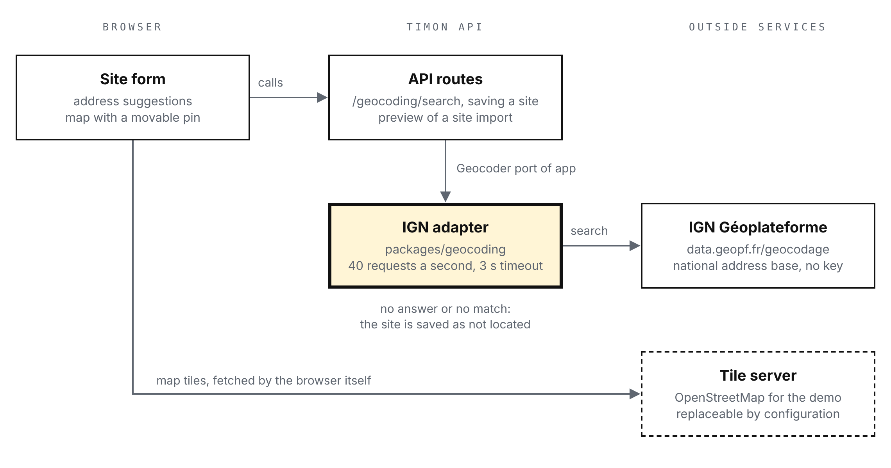

# TIMON-ADR-004 — Maps and geocoding

## Context

[SPEC-002](../specs/0002-customers-and-sites.md) gives every site a location. Three things need an outside service: turning a typed address into suggestions with coordinates, showing a map where the dispatcher places or moves a pin, and locating up to 2,000 lines of a CSV import. [ADR-002](0002-target-architecture.md) records where this code lives; this record explains which services were chosen, under which terms, and how to leave them.

The constraints come from earlier decisions:

- **No secrets in the demo.** The demo is a set of static files ([ADR-003](0003-environments-and-hosting.md)): an API key shipped to the browser is a public key, billed to whoever owns it.
- **The demo works offline.** A geocoding failure must never block saving a site.
- **The coordinates are kept.** A site's location is stored for years and reused by every order, so the terms must allow storing results.
- **Self-hosting stays possible.** Timon is under AGPL-3.0; a haulier running it alone must not need a contract with a vendor.
- **France first.** The target hauliers work mostly in France; a foreign site can be placed by hand for now.

<!-- pagebreak -->

## Options considered

Geocoding, with suggestions while typing:

| Service | Coverage | Suggestions while typing | Key and cost | Storing results | Limit |
| --- | --- | --- | --- | --- | --- |
| **IGN Géoplateforme**, national address base | France | Yes | None, free | Allowed: open licence (Licence Ouverte 2.0) | 50 requests a second per IP address |
| Nominatim, OpenStreetMap's public server | World | Forbidden by its usage policy | None, free | Allowed with attribution (ODbL) | 1 request a second for the whole application |
| Google Geocoding and Places | World | Yes | Key and billing account | Caching forbidden by default; results may not be shown on a non-Google map | Billed per request |
| Self-hosted addok with the address base | France | Yes | A server to run | Allowed: open licence | The machine's |

[Nominatim's policy](https://operations.osmfoundation.org/policies/nominatim/) rules it out: no autocomplete, and one request a second shared by every user. [Google's terms](https://cloud.google.com/maps-platform/terms) forbid using its geocoding with a non-Google map, so choosing it would also choose the map, the key and the bill. addok, the open-source engine behind the address base, is the exit door: the same data, the same kind of answers, on our own server. It cannot run in the demo, which has no server.

The map:

| Library | Rendering | Weight | Status |
| --- | --- | --- | --- |
| **Leaflet 1.9.4** | Raster tiles | Small, about 40 kB compressed | Stable; 2.0 still in alpha on npm |
| MapLibre GL JS | Vector tiles, WebGL | Several times larger | Stable; needs a vector tile provider |
| Google Maps JavaScript API | Google's tiles | Loaded from Google | Key and billing account |

A pin on a site form needs no vector rendering, rotation or 3D. Leaflet does the job at a fraction of the weight and with any raster tile server.

The tiles:

| Tile server | Coverage | Key | Terms that matter |
| --- | --- | --- | --- |
| **OpenStreetMap** (`tile.openstreetmap.org`) | World | None | Best effort, no service level; visible attribution; no prefetching or offline use; access can be withdrawn, notably for commercial services |
| IGN Plan IGN v2 (`data.geopf.fr/wmts`) | France | None | Public service; attribution "© IGN / Géoplateforme" |
| Commercial providers (MapTiler, Stadia Maps…) | World | Yes | Free tier, then billed |

## Decision

> **Decision:** geocoding with the IGN Géoplateforme, behind the `Geocoder` port and called by the API only; Leaflet 1.9.4 for the map; OpenStreetMap tiles for the demo and development, with the tile address and its attribution read from configuration so that a production deployment can switch provider. Foreign sites are placed by hand.
>
> **Why:** it is the only option that offers suggestions while typing, needs no key, lets us store the results and has a self-hosted equivalent. Leaflet is enough for a pin and works with any tile server.

How it is used:

- **One path for geocoding.** The interface never calls the IGN. Suggestions, saving a site and the import preview all go through the API, on Node and in the demo's service worker alike, so there is one adapter, one rate limiter at 40 requests a second, under the service's 50, and one fake for the tests.
- **Failure is a state, not an error.** No answer within 3 seconds, an error or no match saves the site as *not located*. An order will refuse such a site (issue #8), so nothing is planned on a guess.
- **Precision is kept.** Each site records how it was located: house number, street, city, or by hand. A street-level match is shown as such, never passed off as an exact address.
- **Following the tile policy.** Visible attribution on the map; tiles loaded only by the site form, only for the area on screen; the service worker handles `/api` only and never caches tiles; the browser's default referrer policy is kept, never `no-referrer`.
- **Crediting the address base.** The open licence requires citing the source: the site form says the suggestions come from the national address base (IGN).

## Consequences

- **What it makes simpler:** no key, no bill and no contract, in the demo as on a laptop; coordinates stored for good without licence questions; tests that never touch the network.
- **What it costs:** suggestions in France only; two outside services the demo depends on, with no service level from either; the tile address is a setting to choose before real users arrive.
- **What to watch:** the IGN address, which already moved once (api-adresse.data.gouv.fr has redirected to the Géoplateforme since June 2025 and was announced to stay only until January 2026); the adapter keeps that change to one file. The OpenStreetMap tile policy, if the demo's traffic grows. Leaflet 2.0, once stable, changes its API: a small migration limited to the site map.
- **The exit doors:** addok with the address base on our own server for geocoding, behind the same port; IGN Plan or a commercial provider for tiles, by configuration; a second adapter, chosen by country, when foreign sites need suggestions.
- **Out of scope here:** truck routing and road distances, which emissions reports will need (ISO 14083) and which get their own ADR; reverse geocoding; offline maps.

{width=86%}
