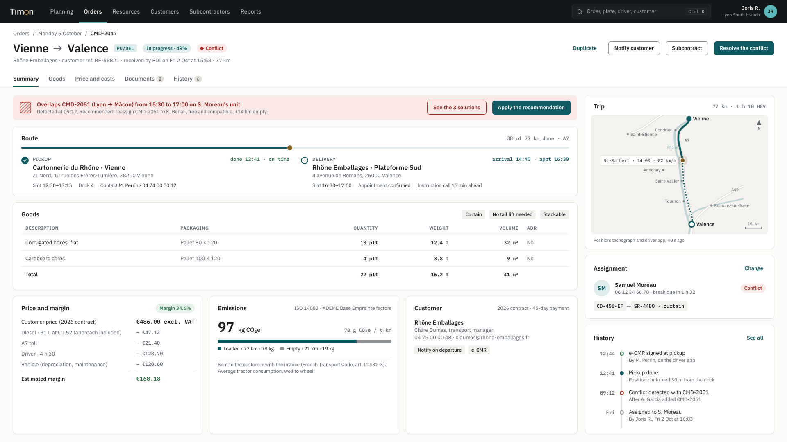

# Timon — Visual identity and mockups

The brand guidelines are a 12-page document: [timon-brand-guidelines.pdf](timon-brand-guidelines.pdf). Their source is [`guidelines/index.html`](guidelines/index.html), printed from Chromium in A4 landscape.

Timon is used all day by dispatchers. The interface stays quiet so the planning carries the information; identity comes from a few signature elements rather than decoration.

## Principles

- **The planning is the interface.** Neutral chrome, so colour always means something: an assignment, a status, a conflict.
- **Show the trade, not a calendar.** A row is a real resource with its unit composition, capabilities and deadlines. Orders, rests, maintenance and washing share the same time axis.
- **A conflict is never missed, and never comes alone.** Overlapping orders split the row into two lanes over a hatched area, and every conflict comes with costed solutions.
- **Space goes to working hours.** Night hours (21:00–05:00) are compressed to a quarter of their width.
- **Dense, not cramped.** 14px text, 32px controls, 60px planning rows; data compared across rows is set in a monospaced face with tabular figures.

## Signature elements

| Element | Where | Why |
| --- | --- | --- |
| The coupling ring | Logo, application bar | The ring of a drawbar (*timon*) replaces the o of the name |
| Unit links | Each planning row | Tractor and trailer drawn as parts joined by a short bar; a missing driver is a dashed link |
| Brass time line | Planning, time header | The only use of the accent colour besides the logo |
| Load curve | Time header | Busy resources per two-hour slot, peaks in orange |
| Two-lane conflict | Planning rows | Overlap shown as geometry, not only as a badge |

## Colour

Light theme first, dark theme supported; every token has both values. Text contrast is at least 4.5:1 in both themes.

| Token | Light | Dark | Use |
| --- | --- | --- | --- |
| `surface` | `#FBFAF8` | `#15181A` | App background |
| `surface-raised` | `#FFFFFF` | `#1C2023` | Panels, rows, cards |
| `ink` | `#1B1F22` | `#ECEAE6` | Text |
| `petrol` | `#0E5B63` | `#5BB8BC` | Brand, primary action, orders in progress |
| `brass` | `#8A6220` | `#D4A452` | Current time, logo ring |
| `ok` | `#2A7448` | `#5CC28A` | Delivered, valid |
| `warning` | `#9A5B00` | `#E0A040` | Late, expiring |
| `conflict` | `#B3261E` | `#F07A70` | Conflict, expired |
| `chartered` | `#6A4C9C` | `#B49AE6` | Subcontracted |
| `chrome` | `#15181A` | `#0F1213` | Application bar, in both themes |

The complete set (33 colours, type, spacing, radii, sizes, shadows) is in [`tokens.json`](tokens.json), the exported source the code will read.

## Typography

IBM Plex Sans for the interface, IBM Plex Sans Condensed inside planning bars, IBM Plex Mono for plates, references, times and quantities. All three are open source (SIL Open Font License).

## Components

The interface is built from 28 components:

- **Planning**: planning row, order bar (8 states), unit links, time header, order card, bulk-action bar
- **Navigation**: application bar, page header, tabs, segmented control
- **Forms**: button, search field, checkbox, radio card
- **Overlays**: hover card, context menu, detail panel
- **Content**: card, data table, meter, deadline list, activity log, itinerary, conflict banner, metric, tag, status badge
- **Brand**: wordmark

## Mockups

The interface is designed in French and English; the mockups here are the English version, the French one lives in the design files. They show the target product with realistic data for a haulier near Lyon. Some elements belong to later phases of the [roadmap](../scoping.md#roadmap): driving times read from the tachograph, live vehicle position, proofs sent from the driver app.

| Screen | File |
| --- | --- |
| Planning, while dragging an order | [planning.png](mockups/planning.png) |
| Planning with the detail panel of an order in conflict | [planning-detail-panel.png](mockups/planning-detail-panel.png) |
| Planning, dark theme | [planning-dark.png](mockups/planning-dark.png) |
| Hover on an order, hover on a driver, right-click menu | [planning-interactions.png](mockups/planning-interactions.png) |
| Order, full page | [order.png](mockups/order.png) |
| Driver record | [driver.png](mockups/driver.png) |
| Resources, drivers tab ([SPEC-001](../specs/0001-resources.md)) | [resources.png](mockups/resources.png) |
| Resource form, a tractor and its documents | [resource-form.png](mockups/resource-form.png) |
| Expiries across all resources | [expiries.png](mockups/expiries.png) |
| CSV import, check step with errors | [resource-import.png](mockups/resource-import.png) |

## Logo

The name in IBM Plex Sans SemiBold, outlined, with the o replaced by the brass coupling ring of a drawbar. The letters follow the text colour; the ring is always brass.

| File | Use |
| --- | --- |
| [`logo/timon-logo.svg`](logo/timon-logo.svg) | Light backgrounds |
| [`logo/timon-logo-on-dark.svg`](logo/timon-logo-on-dark.svg) | Dark backgrounds, application bar |
| [`logo/timon-logo-on-petrol.svg`](logo/timon-logo-on-petrol.svg) | Petrol backgrounds |
| [`logo/timon-icon.svg`](logo/timon-icon.svg) | Icon on its tile: favicon, app icon, avatar (16 to 64 px) |
| [`logo/timon-mark.svg`](logo/timon-mark.svg) | The ring and drawbar alone, on light backgrounds |

Keep the ring's diameter free around the logo; never narrower than 72 px, use the icon below that. Usage rules are on pages 3 and 4 of the [brand guidelines](timon-brand-guidelines.pdf).
