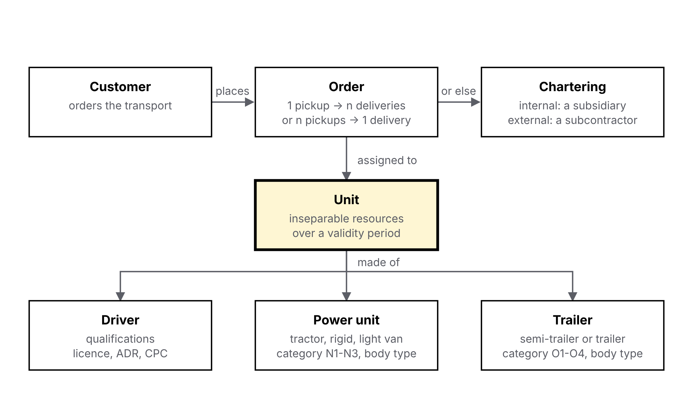
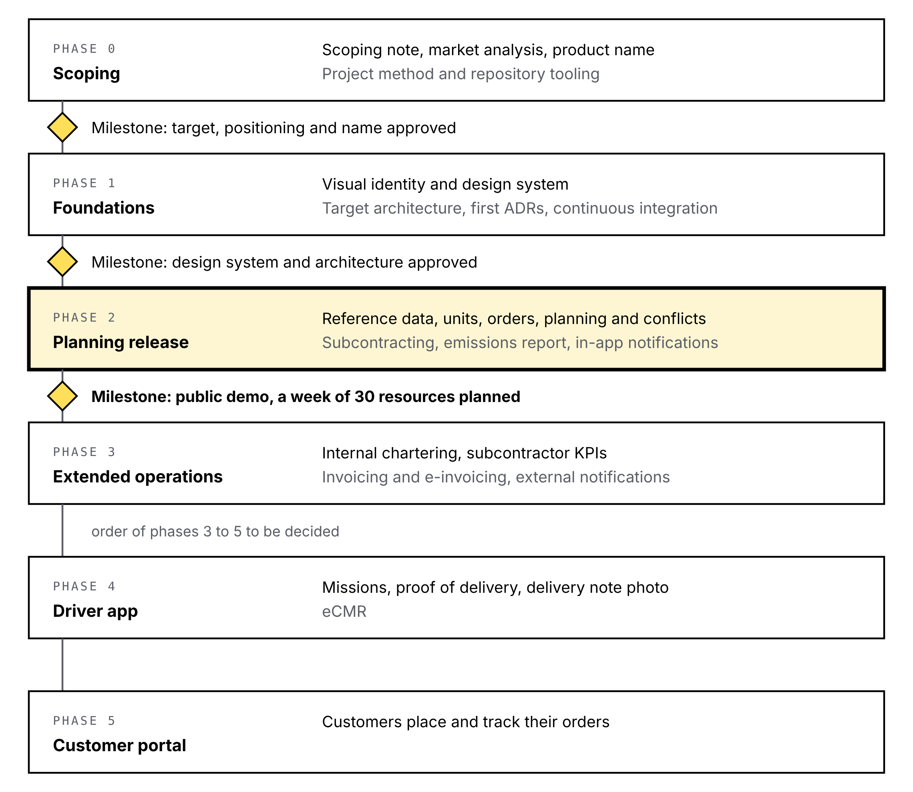

# Timon — Project scoping

## Vision

Timon is a transport management system (TMS) for road hauliers, built around one job: planning resources (drivers, tractors, rigid trucks, trailers and the units they form) without training.

It is a portfolio project run end to end, from scoping to delivery, and it aims to be usable by a real dispatcher. The first release covers the haulier's side, from the moment an order is known. Orders are entered or generated until the customer portal exists; the portal and the driver app come later, but the data model plans for them from day one.

## Target user

The target is the dispatcher of a French road haulage SME running 10 to 100 resources, with one to a few dispatchers. This is a working assumption: the project is a demo and was not validated through interviews.

**The dispatcher.** Orders arrive by email, phone or EDI. The day before, they assign tomorrow's resources: driver, tractor or rigid truck, trailer. During the day they absorb incidents (breakdown, absence, delay, urgent order) and subcontract what the fleet cannot cover. Today this often runs on a spreadsheet or a whiteboard, with orders retyped between tools.

What they need: see at a glance who does what tomorrow, assign an order in one gesture, spot a conflict immediately (unavailable resource, double booking, incompatible trailer, expired licence) and keep track of what was subcontracted.

Later releases add the driver (mobile app: missions, proof of delivery, photo of the delivery note), the customer (portal: placing and tracking orders) and the manager (KPIs, emissions, subcontractor performance).

## Market and positioning

The French haulier TMS market is crowded with SaaS products, but no serious open-source TMS targets European hauliers. Advertised prices sit around a few hundred euros per month for an SME; these figures come mostly from vendor marketing and should be read as orders of magnitude.

| Product | Stated target | What sets it apart | Public price |
| --- | --- | --- | --- |
| [Dashdoc](https://www.dashdoc.com/fr/blog/Meilleurs-logiciels-TMS-en-2025) | Small and mid-size hauliers, brokers, shippers | Offline driver app, eCMR, invoicing, public API | On quote; "from €490/month" per [a directory](https://trouvemonsaas.fr/saas/dashdoc) |
| [Sinari](https://mobilite-alternative.fr/top-5-meilleurs-logiciels-tms-transport-routier-2026/) | SMEs to large accounts | Modular suite, in-house telematics | On quote |
| [Akanea](https://www.shiptify.com/logtech/logiciel-tms-transport) | SMEs and mid-caps, parcel networks | Customs, multi-activity pricing | On quote |
| [Qargo](https://www.dashdoc.com/fr/blog/Meilleurs-logiciels-TMS-en-2025) | SMEs and mid-caps | Reads incoming emails and PDFs to prefill orders | Not public |
| [EASY Transports](https://easytransports.fr/comparatif-logiciel-tms) | 1 to 30 vehicles | Narrow scope, quick start | Usage-based |
| [Cargo-TMS](https://www.cargo-tms.fr/tarif-logiciel-tms/) | Small hauliers | Billed per transport order, unlimited users and vehicles | Per order volume |
| Open-source projects ([OpenTMS](https://github.com/fossabot/open-tms), [open_tms](https://github.com/DominicFinn/open_tms), [loadpartner](https://github.com/loadpartner/tms)) | Varies | Early-stage, shipper-side or North American brokerage | Free |

Installed TMSs are seen as heavy for a small fleet: one vendor puts them at [€145–500/month plus per-seat licences](https://easytransports.fr/logiciel-tms), with weeks of setup.

> **Decision:** resource planning at the core of the product, open source and self-hostable, under AGPL-3.0.
>
> **Why:** no competitor holds that combination, and the AGPL requires any commercial host to publish its changes. Regulatory compliance and native multi-subsidiary support were considered as main angles but rejected: competitors already cover the first, and the second only matters to larger groups.

## Regulatory constraints

Emissions reporting is not optional: hauliers must report greenhouse-gas emissions for every service, and missing it has been fined since 2025. The other texts shape the data model without requiring delivery in the first release.

| Text | What it requires | Timeline | Product impact |
| --- | --- | --- | --- |
| [GHG information for transport services](https://projetcelsius.com/blog/bilan-carbone-transporteur-routier/) (French Transport Code, art. L1431-3) | Report each service's emissions to the customer when origin and destination are in France; fine up to €3,000 | In force since 2013, fined since January 1, 2025 | Per-service emissions in the core product |
| [CountEmissionsEU](https://trans.info/fr/ics2-et-countemissionseu-ce-qui-change-pour-les-transporteurs-dans-l-ue-480571) (Regulation (EU) 2026/1030) | Common method based on EN ISO 14083:2023, well-to-wheel | Applies since June 1, 2026, full rollout by end of 2030 | ISO 14083 calculation; versioned emission factors |
| [French e-invoicing](https://blog.tiime.fr/calendrier-de-la-facturation-electronique-dates-cles-et-echeances-a-ne-pas-manquer) | All companies receive e-invoices; SMEs issue them | Receiving: September 1, 2026; issuing for SMEs: September 1, 2027 | Out of first release, but invoicing must support it from the start |
| [eFTI](https://truxelo.com/glossaire/efti) (Regulation (EU) 2020/1056) | Authorities must accept electronic freight information through a certified platform; no obligation for hauliers | July 9, 2027 | Structured, exportable transport data |
| [eCMR](https://www.signal-tms.com/fr/ecmr) | Electronic consignment note, valid under the CMR additional protocol | Usable today | Driver app phase |
| GDPR | Driver data and geolocation are personal data | In force | Data minimisation, retention periods, driver information |

Driving and rest times (Regulation (EC) 561/2006) strongly constrain planning. They stay out of the first release for lack of tachograph data, but the model must be able to hold them.

## Domain model

The central object is the **unit**: a combination of resources planned as one, to which orders are assigned. An order is either run by one of the company's units or chartered to a subsidiary or a subcontractor.

{width=100%}

**Resources.** Three kinds: the driver, the power unit (tractor, rigid truck or light van) and the trailer (semi-trailer or drawbar trailer). A rigid truck carries the load itself and can also pull a trailer; a tractor carries nothing without a semi-trailer.

**Units.** Inseparable combinations of resources: tractor + driver, tractor + trailer, tractor + driver + trailer, and the same three with a rigid truck. Each unit has a validity period, which covers both the assigned driver (open-ended) and a one-off pairing for a single mission. A resource belongs to one unit at a time: an overlap is a conflict.

**Vehicle categories.** French dispatchers say "PP" and "GP" (small and large rigid), but these are trade terms. The regulatory categories come from the [French Highway Code, art. R311-1](https://www.legifrance.gouv.fr/codes/article_lc/LEGIARTI000051682572), aligned with the EU classification. The model stores the official category and the gross vehicle weight; trade labels become a per-company list.

| Category | Definition (maximum mass) | Trade examples |
| --- | --- | --- |
| N1 | Goods vehicle, ≤ 3.5 t | Light van |
| N2 | Goods vehicle, > 3.5 t and ≤ 12 t | Small rigid |
| N3 | Goods vehicle, > 12 t | Large rigid, tractor |
| O1 | Trailer, ≤ 0.75 t | Rare in freight |
| O2 | Trailer, > 0.75 t and ≤ 3.5 t | Light trailer |
| O3 | Trailer, > 3.5 t and ≤ 10 t | Rigid truck trailer |
| O4 | Trailer, > 10 t | Semi-trailer, heavy trailer |

**Requirements and compliance.** An order carries requirements; a unit can take it only if its resources meet all of them, with documents valid on the mission date. Each document has an expiry date, which drives both renewal alerts and planning conflicts.

| Held by | Examples | Checked against |
| --- | --- | --- |
| Driver | Licence (C1, C, CE), CPC (FIMO/FCO), ADR certificate, driver card, medical fitness, protective equipment | Order and site requirements |
| Vehicle, trailer | Roadworthiness test, ATP certificate (refrigerated), ADR approval, body type, tail lift, crane | Order requirements |
| Order, site | ADR class, temperature control, site-mandated protective equipment, delivery slot | Unit capabilities |

**Chartering.** Internal: a subsidiary of the same group runs the order, with intercompany invoicing. External: a subcontractor runs it. In both cases the order keeps its original customer and traceability, and the emissions report is still owed to the customer.

**Orders.** An order has one pickup and several deliveries, or several pickups and one delivery, never several of both; it may carry any number of products. With one side always single, each product's origin and destination stay unambiguous. A trip that collects at three sites and delivers to four is a chain of orders on the same unit, not one order. An incoming request with several pickups and several deliveries is flagged as two merged orders and split after review, never automatically.

**Compatibility and activities.** Orders state requirements (body type, side loading, temperature, tail lift, ADR) and resources declare matching capabilities; the planning only offers compatible units. Rest, maintenance, inspection, washing and training are activities that block a resource on the same time axis as orders.

**Notifications.** Modelled as domain events (order received, assigned, late, delivered, conflict detected) to which channels subscribe. The first release has an in-app channel only; email, SMS and driver push come later without changing the model.

## First release scope

The first release succeeds when a dispatcher can plan a week of activity for 30 resources without a spreadsheet: assign, see conflicts, subcontract and produce each service's emissions report.

**In scope:**

- Company, subsidiaries and users (multi-subsidiary in the model, one active subsidiary in the interface)
- Reference data: customers, drivers with qualifications, power units, trailers, body types, trade labels
- Units and their validity periods
- Orders: manual entry, CSV import and a demo data generator; one pickup and several deliveries, or several pickups and one delivery
- Resource planning: hour-level slots over one to seven days, assigning an order to a unit, conflict detection (unavailability, double booking, incompatible body type, missing or expired qualification on the mission date) with suggested solutions
- Requirements and capabilities matching; non-order activities (rest, maintenance, washing, training)
- Order and mission statuses, change history
- External subcontracting: subcontractor, purchase price, status
- Per-service emissions under ISO 14083, with ADEME Base Empreinte default factors
- In-app notifications on domain events
- French and English interface from the first screen

**Later:** internal chartering between subsidiaries, driver app (missions, proof of delivery, delivery note photo, eCMR), customer portal, invoicing and e-invoicing, subcontractor KPIs, email, SMS and push notifications.

**Out of scope for now:** automatic route optimisation, telematics and live tracking, driving and rest times, product sequencing rules (washing between incompatible loads), customs, multimodal transport.

## Roadmap

Six phases and three milestones; the visual identity comes in phase 1, once target, positioning and name are settled.

{width=100%}

## Project method

> **Decision:** one scoping phase, then a Kanban flow of vertical increments, each backed by a short spec, tracked in a public GitHub Projects board.
>
> **Why:** Scrum assumes a team and ceremonies that make no sense for a solo developer; Kanban keeps the pace and the traceability, and the board sits next to the code.

Every feature goes through the same cycle:

1. Functional spec of one to two pages: context, user stories, business rules, acceptance criteria in Given/When/Then form, out of scope.
2. Mockup of the screens involved, built on the design system.
3. ADR when the feature forces a technical choice.
4. Implementation, with automated tests derived from the acceptance criteria.
5. Demo: a short video or GIF, and a changelog entry.

Docs live in the repository (`docs/specs`, `docs/adr`, `docs/design`). The board keeps work in progress at 2 items. GitHub milestones match roadmap milestones. Definition of done: spec up to date, tests green, docs and demo done.

## Decisions

| Topic | Decision |
| --- | --- |
| Name | **Timon** (repository and domain: `timon-tms`). In French, a *timon* is the drawbar that ties a team to its wagon, and a *timonier* holds the helm: the product holds resources together and helps the dispatcher keep the day on course. |
| Target | French hauliers with 10 to 100 resources (working assumption) |
| Positioning | Resource planning at the core, open source, AGPL-3.0 |
| Units | Validity period; a resource belongs to one unit at a time |
| Planning granularity | Free slots, to the hour |
| Emission factors | ADEME Base Empreinte first, actual fuel data later; ISO 14083 method |
| Stack | TypeScript and PostgreSQL ([ADR-001](adr/0001-typescript-postgresql.md)) |
| Language | Repository in English; product interface in French and English from the first screen |
| Method | Kanban with one spec per feature, GitHub Projects |
| Visual identity | Petrol and brass, IBM Plex, light and dark themes; logo with the coupling ring as the o ([design](design/README.md)) |
| Order shape | One pickup and n deliveries, or n pickups and one delivery; any number of products; multi-stop trips are chains of orders |
| Compatibility | Order requirements against resource capabilities; non-order activities on the planning; washing rules between products later |

Still open: hosting of the public demo, to settle before the end of the first release; maps and truck routing (an ADR before the order screens).

<!-- pagebreak -->

## Glossary

| French | English (code and docs) | Note |
| --- | --- | --- |
| exploitant | dispatcher | The person who plans resources |
| moyen | resource | Driver, power unit or trailer |
| ensemble | unit | Resources planned as one; may not include a driver |
| tracteur / porteur | tractor / rigid truck | |
| remorque / semi-remorque | trailer / semi-trailer | |
| affrètement | chartering (internal), subcontracting (external) | |
| filiale | subsidiary | |
| information GES | emissions report | Legal per-service greenhouse-gas report |
| lettre de voiture | consignment note (CMR) | |
| bon de livraison (BL) | delivery note | |
| chargement / livraison | pickup / delivery | An order has one of them single |
| puits de commandes | order well | Orders waiting to be assigned |
| aptitude | capability | What a resource can do; matched against order requirements |
| activité | activity | Non-order block on a resource: rest, maintenance, washing |

## Sources

- [Comparatif des logiciels TMS — Dashdoc](https://www.dashdoc.com/fr/blog/Meilleurs-logiciels-TMS-en-2025)
- [Logiciel TMS transport : guide et comparatif — Shiptify](https://www.shiptify.com/logtech/logiciel-tms-transport)
- [Comparatif logiciel TMS TPE/PME — EASY Transports](https://easytransports.fr/comparatif-logiciel-tms)
- [Logiciel TMS pour transporteurs — EASY Transports](https://easytransports.fr/logiciel-tms)
- [Top 5 des TMS transport routier 2026 — Mobilité alternative](https://mobilite-alternative.fr/top-5-meilleurs-logiciels-tms-transport-routier-2026/)
- [Dashdoc, prix et avis — trouvemonsaas](https://trouvemonsaas.fr/saas/dashdoc)
- [Tarifs Cargo-TMS](https://www.cargo-tms.fr/tarif-logiciel-tms/)
- [Bilan carbone d'un transporteur routier — Projet Celsius](https://projetcelsius.com/blog/bilan-carbone-transporteur-routier/)
- [ICS2 et CountEmissionsEU — trans.info](https://trans.info/fr/ics2-et-countemissionseu-ce-qui-change-pour-les-transporteurs-dans-l-ue-480571)
- [Calendrier de la facturation électronique — Tiime](https://blog.tiime.fr/calendrier-de-la-facturation-electronique-dates-cles-et-echeances-a-ne-pas-manquer)
- [eFTI : définition — Truxelo](https://truxelo.com/glossaire/efti)
- [eCMR — Signal TMS](https://www.signal-tms.com/fr/ecmr)
- [Code de la route, art. R311-1 — Légifrance](https://www.legifrance.gouv.fr/codes/article_lc/LEGIARTI000051682572)
